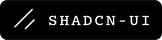

## 🚧 Work in Progress ## 🧭 Frontend 
           
   ## ⚙️ Backend 
        
   ## 🗄️ Database 
       
   ## 🧰 Platforms & Tools 
         

## 🚧 Work in Progress

## 🧭 Frontend

  
  
  
  
  
  
  
  
  
  

 

## ⚙️ Backend

  
  
  
  
  
  
  

 

## 🗄️ Database

  
  
  
  
  
  

 

## 🧰 Platforms & Tools

  
  
  
  
  
  
  

